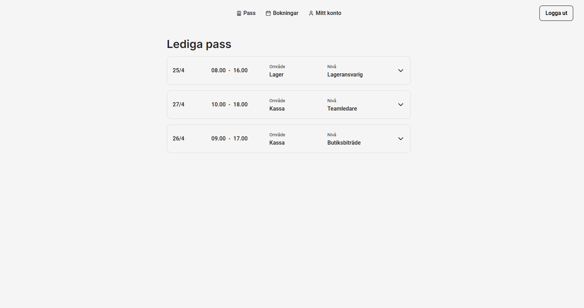
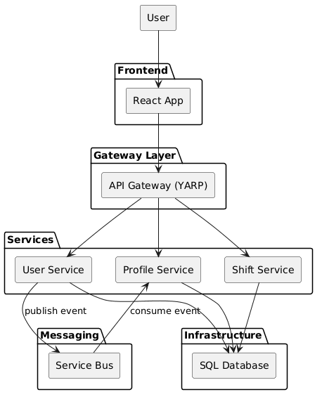

# StaffSystem

A production-style **fullstack shift booking system** built with **.NET, React and modern DevSecOps practices**.

This project was built as my **final portfolio project during my .NET Fullstack YH education**.
Instead of building multiple small demos, I focused on creating **one realistic system that demonstrates how modern software is built, tested, secured and deployed.**

The system is designed with a focus on:

- API Gateway architecture
- Event-driven communication
- Observability and monitoring
- Scalable and maintainable system design

The application is **publicly deployed** and can also be **run locally using Docker**.

---

## Screenshots

<p align="center">
  
  
</p>

## Quick Overview (for recruiters)

This project demonstrates how to build a production-style system using modern DevOps and distributed system practices.

### Architecture



### Key capabilities

- API Gateway using YARP (routing, authentication, cross-cutting concerns)
- Event-driven communication via service bus (automatic profile creation)
- Containerized microservices using Docker
- Centralized authentication (JWT)
- Observability with OpenTelemetry, correlation IDs and health checks
- Clean Architecture with clear separation of concerns

## Event-Driven Communication

The system uses a service bus for asynchronous communication between services.

Example:

- When a user is created → an event is published
- The profile service consumes the event and creates a user profile automatically

This enables:

- Loose coupling between services
- Better scalability
- More resilient system design

---

## Live Demo

Frontend
`https://rasmuswaleij.se/personalportalen`

API Gateway
`https://rasmuswaleij.se/api`

---

## Deployment

The system is designed to mimic a production setup:

- Containerized services using Docker
- API Gateway as single entry point
- Environment-based configuration
- Services communicate over internal network
- Configuration via environment variables

Typical flow:

Code → Build → Container → Run

---

## About Me

I am a soon-to-graduate **.NET Fullstack developer from a Swedish YH program at EC Utbildning**, currently looking for my **first junior developer role**.

My main interests are:

- **Cybersecurity** and building systems resilient against modern threat actors
- **Security implications of AI systems** and how AI will affect future software security
- **DevSecOps** and integrating security practices into the development lifecycle
- **Complex distributed systems** and the challenges that arise when systems scale

This project represents the **engineering practices I want to bring into my first development role**.

---

### Design goals

- Maintainable architecture
- Strong separation of concerns
- Testability
- Cloud-ready infrastructure
- Observable systems

### Architectural principles

- SOLID
- Clean Architecture
- API-first design

---

## Get Started

### Clone the repository

```bash
git clone https://github.com/StaffSystemW/staffsystem.git
```

### Run locally with Docker

Use Docker Compose (v2 preferred):

```bash
docker compose up --build
```

If you are on an older setup:

```bash
docker-compose up --build
```

Services will start automatically.

```
Frontend: http://localhost:3000
API Gateway: http://localhost:8080
```

---

## Frontend

The frontend is built using **React** with a focus on maintainability and good UX patterns.

### Key Features

- Component-driven architecture
- Dedicated API service layer
- Protected routes
- Form validation
- Error handling
- Loading states

### Example structure

```
frontend
│
├── components
├── pages
├── features
├── services
├── config
└── utils
```

---

## Backend

The backend consists of **ASP.NET Web APIs** designed around **Clean Architecture**.

### Features

- RESTful CRUD endpoints
- FluentValidation request validation
- Global exception handling middleware
- Dependency injection
- Health checks

### Development principles

- SOLID
- Separation of concerns
- Testability
- Maintainability

---

## API Gateway

The system uses YARP as an API Gateway to handle cross-cutting concerns.

Responsibilities include:

- Centralized authentication (JWT validation)
- Request routing to backend services
- CORS handling
- Request logging and correlation IDs

This keeps services focused on business logic while the gateway handles shared concerns.
This pattern improves maintainability, security and consistency across services.

---

### Technologies

- Entity Framework Core
- Code-first migrations

### Core entities

- Users
- Profiles
- Workshifts
- Bookings

---

## Observability

### Distributed tracing

- Correlation IDs are generated and propagated across services
- Enables tracing requests through the entire system

### Health monitoring

- Health endpoints for each service
- Dependency health checks via the gateway

---

## Security Practices

Security considerations include:

- JWT-based authentication
- Secure handling of container images
- Separation of concerns via API Gateway

---

## Contact

If you have feedback, questions, or opportunities to collaborate:

LinkedIn: www.linkedin.com/in/rasmus-waleij-4791a7128  
Email: rasmus.waleij@gmail.com
